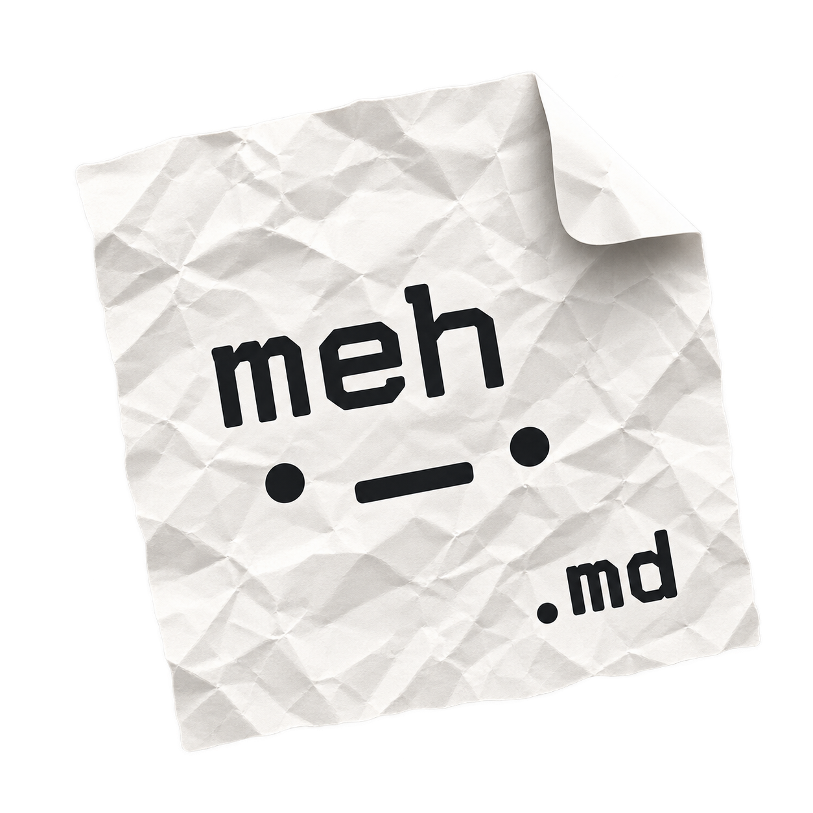

# meh.md - Minimalistic Markdown with a great sync

meh.md is my attempt to finally build the note taking app of my dreams:
Markdown-first, without the whole ‘everything is a block’ thing (I look at
you, Notion and Craft), simple, minimalistic UI, AND: having a great sync
out-of-the-box ⚡️.

## How does sync work?

What I personally find REALLY COOL is the way data is synced: Many apps
either "trust" iCloud files for it (which I found horrible with Obsidian,
especially when editing the same note on multiple devices), or they require
you to sign up for their service (including paying a monthly subscription).
Meh.md goes a slightly different way: Yes, it uses iCloud for storage, but with
[CRDT](https://crdt.tech) under the hood (thanks to the AWESOME
[Automerge](https://automerge.org)
library). What does that mean for you? Local-first syncing without the risk of
conflicts. You can feel safe to edit the same note across multiple devices
with the confidence that everything will be fine. That's pretty cool 😎

## What's the state of the app?

This is an incomplete list of things accomplished so far:

- All the basic Markdown that I need works
- Notes can be imported and exported
- Sync across devices works fairly well, though can still be slow sometimes
- It is pretty responsive, but every now and then there might be a quick
  hiccup
- UI is good enough, but faaar from beautiful
- The code is.. a LOT. I'm 1000% it can be simplified and made more beautiful
  quite a bit. But that's ok. We'll handle that in the future. For now I'm
  trusting my tests and the many ones that AI is doing for me.

If you are curious about the roadmap: Have a look at the open issues. I
use them to track my ideas and goals for the app, and if my limits aren't at
0%, let Codex to implementation for me.

## Where can I get it?

The app is still a work-in-progress, and I'm HEAVILY using AI for it. But
I already trust it as my only note taking app - across iPhone, Mac, and iPad.
For now it is available via TestFlight,
while I iron out things and make the experience nice.
If you are curious, feel free to
[join that group](https://testflight.apple.com/join/NRAvtpSJ). But keep
in mind: Use it at your own risk 🤞

For the long run I plan to make it available on the App Store, most likely
with the option to [buy me a coffee](https://paypal.me/AndreasSkor)
for anyone who likes to. But I think I want
to keep it free (I'm sick of yet another forced subscription service).

## Build it yourself

The project currently targets macOS 27, iOS 27, and iPadOS 27 and needs Xcode
with the corresponding SDKs.

1. Open `meh.md.xcodeproj`.
2. Choose `meh.md Local` for local notes, `meh.md iCloud Dev` for development
   iCloud sync, or `meh.md` to exercise the production Release configuration.
3. Select your Mac, simulator, or connected device and run the app.

For signing, iCloud setup, and the separate development app identities, see
[development builds](docs/development-builds.md) and
[CloudKit setup](docs/cloudkit-sync-setup.md).

## Documentation

Be aware: Those docs are 100% AI-written. Some of them I will probably
refine eventually, but that wasn't my priority so far.

- [Product brief](docs/product.md): goals, scope, and what success looks like.
- [Roadmap](docs/plan.md): milestones and remaining acceptance work.
- [Architecture](docs/architecture.md): how the app fits together.
- [Documentation index](docs/README.md): development guides, contracts,
  decisions, and historical verification records.

- [Writing experience plan](docs/milestone-4-plan.md): milestone-four scope,
  issues, privacy boundary, and editor validation.
